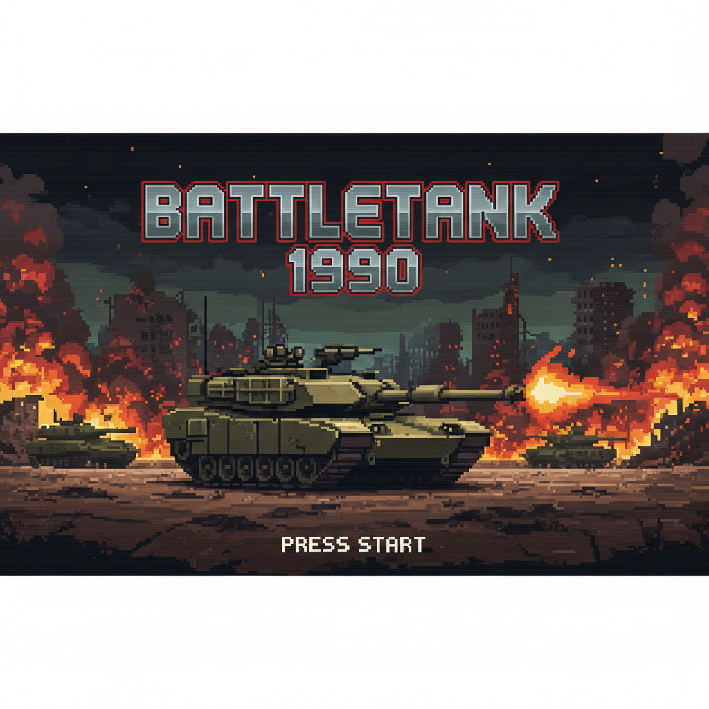

# BattleTank 1990

**BattleTank 1990** is a classic tank warfare game inspired by "Battle City". Defend your base (the Eagle) from waves of enemy tanks, destroy brick walls, and survive as long as you can!

## Features
- **Retro Visuals**: Classic pixel-art style generated procedurally.
- **Destructible Environment**: Shoot through brick walls.
- **Enemy AI**: Different waves of enemies spawning to attack your base.
- **Base Defense**: Protect the Eagle at all costs.
- **Map Generation**: Maps are generated with random layouts each game.
- **Sound Effects**: Retro-style shoot, explosion, and game over sounds generated in real-time.
- **Improved Controls**: Tank size optimized for smoother movement through obstacles.

## Controls
- **Arrow Keys**: Move Tank
- **Space**: Shoot Bullet
- **Enter**: Start Game
- **Esc**: Menu / Exit

## How to Run
1. Ensure you have .NET SDK installed.
2. Open terminal in the project folder.
3. Run command: `dotnet run`

---

# BattleTank 1990 (Bahasa Indonesia)

**BattleTank 1990** adalah game perang tank klasik yang terinspirasi dari "Battle City". Lindungi markasmu (Burung Elang) dari gelombang serangan tank musuh, hancurkan tembok bata, dan bertahan selama mungkin!

## Fitur
- **Visual Retro**: Gaya pixel-art klasik yang dibuat secara prosedural.
- **Lingkungan yang Bisa Dihancurkan**: Tembak tembok bata untuk membuka jalan.
- **AI Musuh**: Gelombang musuh yang muncul untuk menyerang markasmu.
- **Pertahanan Markas**: Lindungi Elang dengan segala cara.
- **Generasi Peta**: Peta dibuat dengan tata letak acak setiap permainan.
- **Efek Suara**: Suara tembakan, ledakan, dan game over gaya retro yang dibuat secara real-time.
- **Kontrol yang Ditingkatkan**: Ukuran tank dioptimalkan untuk pergerakan yang lebih lancar melewati rintangan.

## Kontrol
- **Tombol Panah**: Gerakkan Tank
- **Spasi**: Tembak Peluru
- **Enter**: Mulai Permainan
- **Esc**: Menu / Keluar

## Cara Menjalankan
1. Pastikan .NET SDK sudah terinstall.
2. Buka terminal di folder project.
3. Jalankan perintah: `dotnet run`

---
**Created by Jacky the Code Bender**
*Gravicode Studios*
